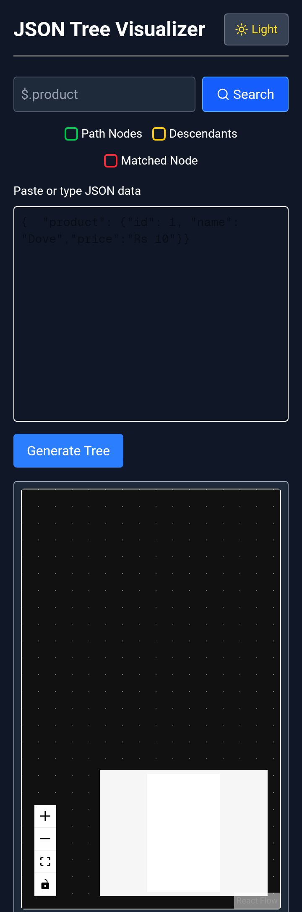
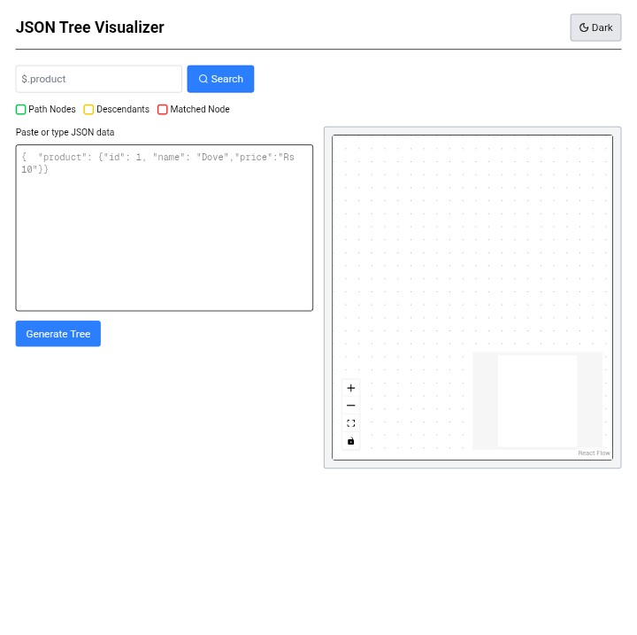
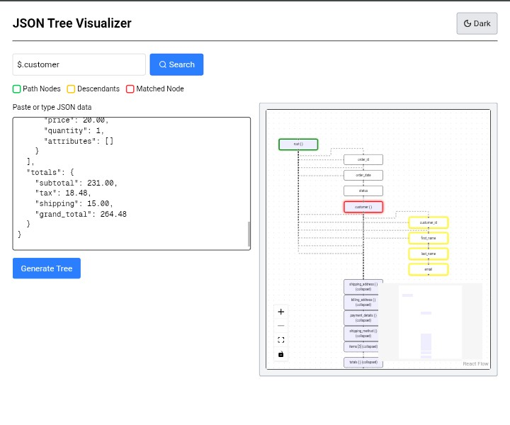

# 🌳 JSON Tree Visualizer

An interactive **JSON Tree Visualizer** built using **Next.js** and **React Flow** for the **APIWIZ Frontend Assignment**.  
It allows users to visualize, explore, and search JSON data in a hierarchical tree format with beautiful UI and dark/light mode support.

---

## 🚀 **Live Demo**

🔗 [Click to view live](https://json-tree-visualizer-pi.vercel.app/)
---

## 🧩 **Features**

### 📝 JSON Input & Validation
- Paste or type JSON data in the input box.
- Automatic JSON validation with clear error messages.
- “Visualize” button to generate the tree view instantly.

### 🌳 Tree Visualization (via React Flow)
- Displays JSON structure as a connected **hierarchical node tree**.
- Distinct color codes for each data type:
  - 🟣 **Objects** – Blue/Purple tone  
  - 🟢 **Arrays** – Green tone  
  - 🟠 **Primitives** – Yellow/Orange tone
- Smooth parent–child connections using **React Flow** edges.

### 🔍 Search by JSON Path
- Search any JSON key or full path (e.g. `$.product` or `items[0].name`).
- Automatically pans and zooms to the matching node.
- Color-coded highlighting:
  - 🔴 **Red** — Exact match  
  - 🟢 **Green** — Path ancestors  
  - 🟡 **Yellow** — Descendants  

### 🌗 Dark / Light Mode
- Seamless toggle for light and dark themes.
- Input, buttons, and canvas adjust dynamically.

### 🧭 Interactivity
- Drag, zoom, and pan to navigate large trees.
- Fit View, Zoom In/Out controls (built-in React Flow).
- Collapsible nodes for large datasets (performance optimized).

---

## 🛠️ **Tech Stack**

| Tool | Purpose |
|------|----------|
| **Next.js (React 18)** | App framework |
| **React Flow** | Tree visualization engine |
| **Tailwind CSS** | Styling and layout |
| **Lucide Icons** | UI icons (Search, Moon, Sun) |
| **TypeScript** | Type-safe development |

---

## ⚙️ **Project Setup**

### 1️⃣ Clone the Repository
```bash
git clone https://github.com/yourusername/json-tree-visualizer.git
cd json-tree-visualizer
```

2️⃣ Install Dependencies
```
npm install
```
3️⃣ Run Development Server
```
npm run dev
```
App will be live at:
👉 http://localhost:3000


---

📦 Build & Deployment

Build for Production
```
npm run build
```
Start Production Server
```
npm start
```


---

📸 Screenshots




---

🧑‍💻 Author

Roushan Kumar
## 📫 Let’s Connect  

[](https://www.linkedin.com/in/roushan-kumar-764b691b4/)  
[](mailto:roushan.fs.dev@gmail.com)  

---

## 👀 Profile Visitors  


---

🏁 Assignment Reference

This project fulfills the requirements of the
APIWIZ - Frontend Intern / SDE I / SDE II / SDE III Assignment
